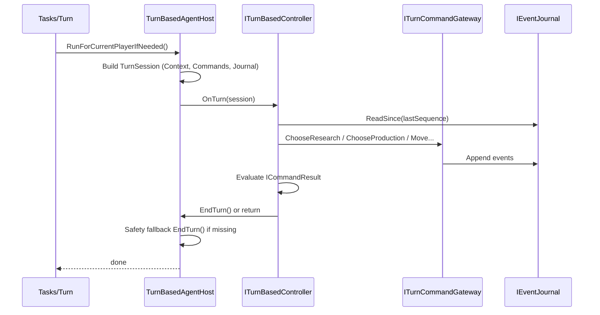

# AI API Developer Guide (Clean AI API v2)

## 1) What is this?

This API lets you control an AI player's turn through one stable entrypoint.

Goal:

- Keep AI logic isolated from game internals.
- Read game state through readonly views.
- Change game state only through explicit commands.
- Track incremental state changes through an event journal.

In short:

- Read from context.
- Act via command gateway.
- End turn.

## 2) Why this architecture exists

Legacy AI code called engine internals directly.
That made behavior hard to test, hard to replace, and hard to sandbox.

Clean AI API v2 introduces:

- A single turn session object.
- Read models (`ITurnContext`, view interfaces).
- Write models (`ITurnCommandGateway` and sub-gateways).
- Sequence-based event journal (`IEventJournal`).
- Host-enforced limits and safety guards.

## 3) Big picture flow

1. Host starts AI turn.
2. Host builds `ITurnSession`.
3. Host calls `ITurnBasedController.OnTurn(session)`.
4. AI reads from `session.Context`.
5. AI optionally reads deltas from `session.Events`.
6. AI sends commands to `session.Commands`.
7. AI (or host fallback) ends turn.

## 4) Where to start (recommended order)

1. Read API contracts in `api/src/Agents`.
2. Read runtime host in `src/Agents/TurnBasedAgentHost.cs`.
3. Implement your own `ITurnBasedController`.
4. Implement registration (`IAgentRegistration`, metadata, memory).
5. Register and bind your AI via `AgentLoaderEntry`.
6. Run targeted tests and a manual in-game smoke test.

## 5) Build your own AI class

### Step 1: Implement a controller

Create a class that implements `ITurnBasedController`.

```csharp
using CivOne.Agents;

public sealed class MyTurnController : ITurnBasedController
{
    public void OnTurn(ITurnSession session)
    {
        // 1) Pick research if none selected.
        if (session.Context.CurrentResearchName is null
            && session.Context.AvailableResearchNames.Count > 0)
        {
            _ = session.Commands.Research.ChooseResearch(
                session.Context.AvailableResearchNames[0]);
        }

        // 2) Pick city production by internal names.
        foreach (ICityView city in session.Context.OwnCities)
        {
            if (city.CurrentProductionName is null
                && city.AvailableProductionNames.Count > 0)
            {
                _ = session.Commands.Cities.ChooseProduction(
                    city.Id,
                    city.AvailableProductionNames[0]);
            }
        }

        // 3) End turn explicitly.
        session.EndTurn();
    }
}
```

### Step 2: Add registration class

Implement `IAgentRegistration` with:

- `IAgentInformation` (name, author, version, UUID)
- `IAgentMemory` (YAML string store)
- `ITurnBasedController` instance

Tip:

- Keep UUID stable.
- Keep memory payload forward-compatible.

### Step 2.1: YAML memory as DTO via delegate class

Yes, YAML in string form and restoring from that string is supported.
You can use a delegate class so your AI implementation only manages one DTO.

Production helper:

- `AgentMemoryDtoDelegate<TDto>` in `src/Agents/AgentMemoryDtoDelegate.cs`

Minimal example DTO and wiring:

```csharp
using CivOne.Agents;

public sealed class MyAiMemoryDto
{
  public string Policy { get; set; } = "economic";
  public int AggressionLevel { get; set; } = 2;
  public bool ConservativeMovement { get; set; } = true;
}

public sealed class MyAiMemory : IAgentMemory
{
  private MyAiMemoryDto _state = new();
  private readonly AgentMemoryDtoDelegate<MyAiMemoryDto> _delegate;

  public MyAiMemory()
  {
    _delegate = new AgentMemoryDtoDelegate<MyAiMemoryDto>(
      snapshotDelegate: () => _state,
      restoreDelegate: dto => _state = dto,
      createDefaultDelegate: () => new MyAiMemoryDto(),
      useDefaultOnDeserializationError: true);
  }

  public void SetMemory(string yaml) => _delegate.SetMemory(yaml);

  public string GetMemory() => _delegate.GetMemory();
}
```

Notes:

- Add new DTO fields over time with defaults to stay backward compatible.
- Keep DTO focused on memory state only (no runtime object references).
- Invalid/empty YAML can safely fall back to a default DTO.

Nested DTO example (cities + unit goals + diplomacy):

```csharp
using CivOne.Agents;

public sealed class StrategicAiMemoryDto
{
  public string Policy { get; set; } = "expansion";
  public int LastProcessedTurn { get; set; }
  public Dictionary<string, CityPlanDto> Cities { get; set; } = [];
  public List<UnitGoalDto> UnitGoals { get; set; } = [];
  public DiplomacyStateDto Diplomacy { get; set; } = new();
}

public sealed class CityPlanDto
{
  public string PreferredProduction { get; set; } = "Barracks";
  public int GrowthPriority { get; set; } = 1;
}

public sealed class UnitGoalDto
{
  public Guid UnitId { get; set; }
  public string Goal { get; set; } = "Scout";
  public int TargetX { get; set; }
  public int TargetY { get; set; }
}

public sealed class DiplomacyStateDto
{
  public Dictionary<string, int> AttitudeByTribe { get; set; } = [];
}

public sealed class StrategicAiMemory : IAgentMemory
{
  private StrategicAiMemoryDto _state = new();
  private readonly AgentMemoryDtoDelegate<StrategicAiMemoryDto> _delegate;

  public StrategicAiMemory()
  {
    _delegate = new AgentMemoryDtoDelegate<StrategicAiMemoryDto>(
      snapshotDelegate: () => _state,
      restoreDelegate: dto => _state = dto,
      createDefaultDelegate: () => new StrategicAiMemoryDto(),
      useDefaultOnDeserializationError: true);
  }

  public void SetMemory(string yaml) => _delegate.SetMemory(yaml);

  public string GetMemory() => _delegate.GetMemory();
}
```

### Step 3: Register and bind

Use `AgentLoaderEntry`:

- `Register(registration)` to register your AI.
- `BindPlayer(playerGuid, agentGuid)` to map runtime player to your AI.

### Step 4: Respect internal-name commands

Production and research selection must use internal type names.
Examples:

- `Alphabet`
- `Barracks`

Do not use translated UI strings for command parameters.

### Step 5: Handle command results

Every command returns `ICommandResult`.
Check at least:

- `Success`
- `ErrorCode`
- `SequenceBefore`
- `SequenceAfter`

Common stop conditions:

- `TURN_ALREADY_ENDED`
- `TOTAL_ACTION_LIMIT_REACHED`
- `ACTION_TYPE_LIMIT_REACHED`

## 6) Runtime guarantees and limits

Host/runtime enforces:

- Turn safety fallback: if AI forgets `EndTurn()`, host ends turn.
- Total command limit per turn.
- Per-action-type command limits.
- Exception isolation around controller execution.
- Agent memory load/save per player around each host-managed turn.
- Metrics hook callback per host-managed turn (commands, failures, duration).

This means your AI should:

- Be deterministic where possible.
- Check command failures.
- Exit early on limit errors.

Memory persistence details:

- Host tries to load persisted YAML before controller execution.
- Host saves current YAML after turn execution.
- Default file location: `<StorageDirectory>/ai-memory/<playerGuid>.yaml`.
- Persisted file stores metadata plus memory payload (`MemoryYaml`).
- Current metadata fields: `FormatVersion`, `SavedAtUtc`, `PlayerGuid`, `AgentGuid`, `AgentName`, `AgentAuthor`, `GameTurn`.
- Backward compatibility: old raw-memory YAML files are still accepted on load.

Example persisted AI memory file:

```yaml
FormatVersion: 1
SavedAtUtc: 2026-06-01T12:34:56.0000000Z
PlayerGuid: 6a1f4d9f-6fd8-4f92-9f8a-6db0af0a1d19
AgentGuid: 8f37a1b7-7904-4d34-a525-0db987047a45
AgentName: SampleAgent
AgentAuthor: MyCompany
GameTurn: 42
MemoryYaml: |
  Policy: economic
  AggressionLevel: 2
  ConservativeMovement: true
```

Notes:

- `MemoryYaml` keeps your agent-owned YAML payload unchanged.
- Host metadata is maintained by runtime and overwritten on each save.

## 7) Class overview with explanations

PlantUML class diagram file:

- [docs/AI/ai-api-class-diagram.puml](docs/AI/ai-api-class-diagram.puml)
- [docs/AI/ai-api-public-diagram.puml](docs/AI/ai-api-public-diagram.puml) (compact Public API view)

### Public API contracts (api/src/Agents)

- [api/src/Agents/AgentRegistration.cs](api/src/Agents/AgentRegistration.cs)
  - [IAgentInformation](api/src/Agents/AgentRegistration.cs#L9): metadata contract.
  - [IAgentMemory](api/src/Agents/AgentRegistration.cs#L47): serialized memory exchange.
  - [IAgentRegistration](api/src/Agents/AgentRegistration.cs#L67): combines metadata, memory, controller.

- [api/src/Agents/TurnSession.cs](api/src/Agents/TurnSession.cs)
  - [ITurnBasedController](api/src/Agents/TurnSession.cs#L10): single AI entrypoint (OnTurn).
  - [ITurnSession](api/src/Agents/TurnSession.cs#L23): root per-turn object.
  - [ITurnContext](api/src/Agents/TurnSession.cs#L51): readonly live game view.

- [api/src/Agents/Commands.cs](api/src/Agents/Commands.cs)
  - [ITurnCommandGateway](api/src/Agents/Commands.cs#L165): root write gateway.
  - [IUnitCommandGateway](api/src/Agents/Commands.cs#L57): unit actions.
  - [ICityCommandGateway](api/src/Agents/Commands.cs#L137): production actions.
  - [IResearchCommandGateway](api/src/Agents/Commands.cs#L151): research actions.
  - [ICommandResult](api/src/Agents/Commands.cs#L9) / [CommandResult](api/src/Agents/Commands.cs#L28): command result + sequence bounds.

- [api/src/Agents/Events.cs](api/src/Agents/Events.cs)
  - [IEventJournal](api/src/Agents/Events.cs#L59): incremental event reads.
  - [AgentEventKind](api/src/Agents/Events.cs#L10), [AgentEvent](api/src/Agents/Events.cs#L33): event model.
  - [EventReadResult](api/src/Agents/Events.cs#L49): cursor/resync model.

- [api/src/Agents/Views.cs](api/src/Agents/Views.cs)
  - Readonly view models:
    - [ICivilizationView](api/src/Agents/Views.cs#L10)
    - [IUnitView](api/src/Agents/Views.cs#L56)
    - [ICityView](api/src/Agents/Views.cs#L132)
    - [ITileView](api/src/Agents/Views.cs#L203)
    - [IMapView](api/src/Agents/Views.cs#L274)

### Runtime implementation (src/Agents)

- [src/Agents/TurnBasedAgentHost.cs](src/Agents/TurnBasedAgentHost.cs#L23)
  - Main turn orchestration.
  - Registry resolution fallback.
  - Session/context/gateway/journal runtime implementations.
  - Built-in default controller.

- [src/Agents/AgentRegistry.cs](src/Agents/AgentRegistry.cs#L10)
  - Internal registry storing AI registrations.
  - Player-to-agent binding resolution.

- [src/Agents/AgentLoaderEntry.cs](src/Agents/AgentLoaderEntry.cs#L9)
  - Minimal external entrypoint for registering/binding agents.

### Runtime integration points

- [src/Tasks/Turn.cs](src/Tasks/Turn.cs)
  - Calls host for AI players in turn processing path.

- [src/Tasks/ProcessScience.cs](src/Tasks/ProcessScience.cs)
  - Skips legacy AI research chooser for host-managed players.

- [src/City.cs](src/City.cs)
  - Skips legacy AI city production chooser for host-managed players.

### Runtime routing: legacy AI vs new AI

Current runtime uses a mixed mode.
The decision is made by `TurnBasedAgentHost.ShouldHandlePlayer(player)`.

Rule summary:

- New AI path is used when player is non-human and host-managed.
- Legacy AI path is used when player is human, barbarian, or otherwise not host-managed.

Concrete behavior matrix:

| Player type / state | Move flow (`Tasks/Turn`) | Research flow (`Tasks/ProcessScience`) | City production flow (`City`) |
| --- | --- | --- | --- |
| Human player | Human UI flow (not AI) | Human UI flow (TechSelect/Discovery) | Human city management/UI |
| AI player, host-managed (`ShouldHandlePlayer == true`) | New turn-based host/controller path | Legacy `AI.ChooseResearch()` is skipped | Legacy `AI.CityProduction(...)` is skipped |
| AI player, not host-managed (`ShouldHandlePlayer == false`) | Legacy `AI.Move(...)` | Legacy `AI.ChooseResearch()` | Legacy `AI.CityProduction(...)` |

Important detail:

- Host-managed currently excludes barbarians.
- If no external agent is bound, host-managed players still run through the new API surface using built-in `LegacyAgentRegistration` + `DefaultTurnBasedController` (command gateway path), not direct legacy AI calls.

## 8) Suggested first milestone

Implement a minimal AI that only:

- Picks research when empty.
- Picks production for idle cities.
- Ends turn.

Then add unit movement in a second milestone.

Example implementation flow (short):

1. Create a controller class (`ITurnBasedController`) in your AI project and implement:

- research pick from `session.Context.AvailableResearchNames`
- city production pick from `city.AvailableProductionNames`
- explicit `session.EndTurn()` in every exit path

1. Create an `IAgentRegistration` that returns:

- metadata (`IAgentInformation`)
- memory (`IAgentMemory`, optional DTO via `AgentMemoryDtoDelegate<TDto>`)
- your controller instance

1. Register and bind at startup:

- `AgentLoaderEntry.Register(registration)`
- `AgentLoaderEntry.BindPlayer(playerGuid, agentGuid)`

1. Validate with tests first:

- controller unit test for research/production/end-turn
- one resilience test for limit error codes

1. Add movement as phase 2:

- try ordered directions
- stop immediately on `TURN_ALREADY_ENDED`, `TOTAL_ACTION_LIMIT_REACHED`, `ACTION_TYPE_LIMIT_REACHED`

### Done in 30 minutes (minimum slice)

Target:

- One AI player can finish one turn through the new API without crashing.

Do this in order:

1. Implement only research pick + city production pick + explicit end turn.
2. Register and bind one AI player.
3. Run exactly these 3 minimum tests:

- controller picks first research when none is set
- controller picks first production for idle city
- controller always ends turn

Definition of done for this mini slice:

- AI turn completes.
- No host exception fallback triggered.
- 3 minimum tests are green.

## 9) Testing strategy

Recommended sequence:

1. Unit tests for controller behavior (mocked session/context/gateway).
2. Unit tests for journal cursor behavior.
3. In-game smoke test with one AI civilization.

Existing related tests:

- `xunit/src/AgentControllerTests.cs`
- `xunit/src/AgentEventJournalTests.cs`
- `xunit/src/AgentControllerResilienceTests.cs`
- `xunit/src/TurnBasedAgentHostIntegrationTests.cs`
- `xunit/src/AgentMemoryDtoDelegateTests.cs`

### Manual smoke test (UI)

Use this quick manual flow after unit tests.

Recommended setup:

- Start a new game with at least 2 civilizations.
- Keep one human player and one AI player.
- Pick any non-barbarian AI civilization (barbarian path currently stays legacy).
- Use normal/default difficulty and map size for first check.

UI flow:

1. Start game from main menu (`New Game`).
2. In player/civilization setup, ensure target AI civ is active as AI.
3. Let game enter map view.
4. End human turn repeatedly (use normal end-turn UI/button).
5. Watch AI turn transitions for 5 to 10 turns.

What to verify:

- AI turn always completes (no stuck turn).
- AI selects research when empty.
- AI assigns production for idle cities.
- No repeated host fallback warning about missing `EndTurn()`.
- No crash when commands fail due to limits/invalid actions.

If behavior is unclear:

- Repeat with a different non-barbarian AI civilization.
- Repeat with one more AI player enabled to increase command pressure.

### Manual smoke-test evidence log

Use this block to keep one short, reproducible evidence entry in-repo.

```text
Date (UTC): 2026-06-01
Build/Test baseline: Targeted host integration tests green
Scenario: Pending manual in-game run
Result: Not executed in this session (manual UI execution required)
Observed host warnings: n/a
Observed crashes: n/a
Notes: Run steps from section "Manual smoke test (UI)" and replace this entry with actual results.
```

## 10) Common pitfalls

- Using localized strings instead of internal names.
- Ignoring command result errors.
- Not ending turn.
- Assuming event journal is full state (it is delta hints only).
- Not handling cursor expiration (`RequiresFullResync`).

## 11) Quick checklist

- Controller implements `ITurnBasedController`.
- Registration implements `IAgentRegistration`.
- Stable UUID defined.
- Memory contract implemented.
- Agent registered and bound.
- Command failures handled.
- Turn ends reliably.
- Basic tests added.

## 12) TODO (Developer + Project)

Use this as a practical backlog for AI API v2 work.

### Must-have next

- [x] Add one complete sample agent package (controller + registration + binding example).
- [x] Add integration test for host fallback behavior when controller throws.
- [x] Add integration test for host auto-`EndTurn()` fallback.
- [x] Add boundary tests for total command limit and per-command-type limit in runtime session.
- [x] Document exact error code contract in one table (`ErrorCode`, meaning, expected caller reaction).

### Should-have soon

- [x] Add event journal usage example with `ReadSince(...)` cursor persistence.
- [x] Add "resync required" recovery example when `RequiresFullResync == true`.
- [x] Add strategy examples for unit movement that stop cleanly on limit errors.
- [x] Add deterministic test fixture for one full AI turn (research + city production + end turn).
- [x] Add a short troubleshooting section (binding not resolved, empty research list, no movable units).
- [x] Add proof tests that all known command error paths are handled robustly.
- [x] Add test coverage for cursor-expiry handling with full resync path in controller.
- [x] Add forced-error-path tests for real `DefaultTurnBasedController`.

### Nice-to-have

- [x] Add sequence diagram for one full turn (host -> controller -> commands -> journal).
- [x] Add metrics hooks (commands per turn, failed commands, average turn duration).
- [x] Add optional AI profile presets (economic, expansion, military) as examples.

### Out of current scope (track for later)

- [ ] Diplomacy command surface and diplomacy-related event kinds.
- [x] External plugin loading flow documentation (assembly discovery, validation, isolation).

### Definition of done for a new AI implementation

- [ ] AI can complete a full turn without host warnings.
- [x] AI handles all command failures without crashing.
- [x] AI remains functional when journal cursor expires (full context resync path).
- [ ] AI has unit tests and one manual in-game smoke test result documented.

## 13) Complete sample agent package

The following is a complete, minimal package that you can adapt.

```csharp
using System;
using System.Collections.Generic;
using CivOne.Agents;

namespace MyCompany.CivOneAi
{
  public sealed class SampleTurnController : ITurnBasedController
  {
    public void OnTurn(ITurnSession session)
    {
      ArgumentNullException.ThrowIfNull(session);

      // Research: choose first available if none selected.
      if (session.Context.CurrentResearchName is null
        && session.Context.AvailableResearchNames.Count > 0)
      {
        ICommandResult researchResult = session.Commands.Research.ChooseResearch(
          session.Context.AvailableResearchNames[0]);
        if (!researchResult.Success)
        {
          session.EndTurn();
          return;
        }
      }

      // Cities: choose first available production for idle cities.
      foreach (ICityView city in session.Context.OwnCities)
      {
        if (city.CurrentProductionName is not null || city.AvailableProductionNames.Count == 0)
        {
          continue;
        }

        ICommandResult productionResult = session.Commands.Cities.ChooseProduction(
          city.Id,
          city.AvailableProductionNames[0]);
        if (!productionResult.Success)
        {
          // Non-fatal: continue with remaining cities.
        }
      }

      // Units: conservative movement example.
      foreach (IUnitView unit in session.Context.OwnUnits)
      {
        if (!unit.HasMovesLeft || unit.HasAction)
        {
          continue;
        }

        ICommandResult moveResult = session.Commands.Units.Move(unit.Id, 1, 0);
        if (!moveResult.Success && ShouldStopTurn(moveResult.ErrorCode))
        {
          session.EndTurn();
          return;
        }
      }

      session.EndTurn();
    }

    private static bool ShouldStopTurn(string errorCode)
    {
      return string.Equals(errorCode, "TURN_ALREADY_ENDED", StringComparison.Ordinal)
        || string.Equals(errorCode, "TOTAL_ACTION_LIMIT_REACHED", StringComparison.Ordinal)
        || string.Equals(errorCode, "ACTION_TYPE_LIMIT_REACHED", StringComparison.Ordinal);
    }
  }

  public sealed class SampleAgentInformation : IAgentInformation
  {
    private static readonly Guid _agentId = Guid.Parse("8F37A1B7-7904-4D34-A525-0DB987047A45");

    public string GetName() => "SampleAgent";
    public string GetAuthor() => "MyCompany";
    public (int Major, int Minor, int Patch) GetVersion() => (1, 0, 0);
    public string GetDescription() => "Minimal AI example for Clean AI API v2.";
    public Guid GetUuid() => _agentId;
  }

  public sealed class SampleAgentMemory : IAgentMemory
  {
    private string _yaml = "lastPolicy: default\n";

    public void SetMemory(string yaml)
    {
      _yaml = yaml ?? string.Empty;
    }

    public string GetMemory() => _yaml;
  }

  public sealed class SampleAgentRegistration : IAgentRegistration
  {
    private readonly IAgentInformation _information = new SampleAgentInformation();
    private readonly IAgentMemory _memory = new SampleAgentMemory();
    private readonly ITurnBasedController _controller = new SampleTurnController();

    public IAgentInformation GetInformation() => _information;
    public IAgentMemory GetMemory() => _memory;
    public ITurnBasedController GetTurnBasedController() => _controller;
  }

  public static class SampleAgentBootstrap
  {
    public static void RegisterAndBind(Guid playerGuid)
    {
      IAgentRegistration registration = new SampleAgentRegistration();
      Guid agentGuid = registration.GetInformation().GetUuid();

      AgentLoaderEntry.Register(registration);
      AgentLoaderEntry.BindPlayer(playerGuid, agentGuid);
    }
  }
}
```

## 14) Error code reference

The table below reflects current runtime behavior in `TurnBasedAgentHost` command gateways.

| ErrorCode | Where it can happen | Meaning | Recommended caller reaction |
| --- | --- | --- | --- |
| `TURN_ALREADY_ENDED` | Any command | Session already ended | Stop issuing commands immediately. |
| `TOTAL_ACTION_LIMIT_REACHED` | Any command | Total per-turn command budget exceeded | Stop issuing commands, end planning loop. |
| `ACTION_TYPE_LIMIT_REACHED` | Any command | Per-command-type budget exceeded | Stop this action strategy, usually end turn. |
| `UNIT_NOT_FOUND` | Unit commands | Unit not found or not owned by current player | Refresh unit list from context, skip command. |
| `MOVE_REJECTED` | `Units.Move` | Runtime path/terrain/move validation rejected move | Try alternative move or fallback behavior. |
| `INVALID_UNIT_TYPE` | Settler-only commands | Command requires a specific unit type | Do not retry this command for that unit. |
| `INVALID_PRODUCTION_NAME` | `Cities.ChooseProduction` | Empty or invalid production name input | Fix caller input generation. |
| `CITY_NOT_FOUND` | `Cities.ChooseProduction` | City not found or not owned by current player | Refresh city list, skip city. |
| `PRODUCTION_NOT_AVAILABLE` | `Cities.ChooseProduction` | Requested production not in city options | Pick from `AvailableProductionNames`. |
| `INVALID_RESEARCH_NAME` | `Research.ChooseResearch` | Empty or invalid research name input | Fix caller input generation. |
| `RESEARCH_NOT_AVAILABLE` | `Research.ChooseResearch` | Requested research not in current options | Pick from `AvailableResearchNames`. |

## 15) Event journal cursor usage

Use a persisted cursor per player to read incremental events.

```csharp
public sealed class JournalCursorState
{
  public ulong LastSequence { get; set; }
}

public static void ConsumeDeltaEvents(ITurnSession session, JournalCursorState state)
{
  EventReadResult delta = session.Events.ReadSince(state.LastSequence);

  if (delta.RequiresFullResync)
  {
    // Cursor too old: rebuild local model from current context.
    RebuildModelFromContext(session.Context);
    state.LastSequence = delta.ToSequence;
    return;
  }

  foreach (AgentEvent e in delta.Events)
  {
    ApplyEventToLocalModel(e);
  }

  state.LastSequence = delta.ToSequence;
}
```

Notes:

- Journal events are hints, not full state.
- `ITurnContext` remains source of truth.

### Current event emission coverage (what, when, and what not)

Events are appended by runtime command gateways after successful command execution.
Unit-removal events (`UnitDisbanded`, `UnitDestroyed`) are appended by the runtime removal hook at the actual removal point.
If command validation fails (`TURN_ALREADY_ENDED`, limits, invalid input, ownership checks, etc.), no journal event is appended.

Host-level event:

- `TurnStarted` is appended once at start of host-managed turn, before `ITurnBasedController.OnTurn(session)`.

Command/event matrix:

| Command | Event emitted | When emitted |
| --- | --- | --- |
| `Units.Move` | `UnitMoved`, `TilesExplored` | After successful runtime move (`MoveTo` accepted) |
| `Units.Disband` | `UnitDisbanded` | When the marked unit is actually removed |
| `Units.FoundCity` | `CityProductionChanged` (queued order) | After found-city order is queued |
| `Cities.ChooseProduction` | `CityProductionChanged` | After production is set |
| `Research.ChooseResearch` | `ResearchChanged` | After current research is set |

Additional runtime-emitted event:

| Trigger | Event emitted | When emitted |
| --- | --- | --- |
| Actual unit loss not marked as explicit disband (for example combat destruction) | `UnitDestroyed` | When the unit is actually removed |

`UnitDestroyed` is reserved for actual unit loss (for example combat/game mechanics), not voluntary disband.
This makes event consumers able to distinguish intentional removal from destruction.

### Combat attack special case (important)

There is no dedicated `Attack` command in v2.
An attack is initiated through `Units.Move(unitId, dx, dy)` when the target tile is hostile.

How to detect that a move would attack:

- Compute target coordinates from the unit position plus `(dx, dy)`.
- Read the target tile through `session.Context.Map.GetTile(targetX, targetY)`.
- Treat the move as an attack intent if one of the following is true:
  - target tile has visible units not belonging to your own unit-id set
  - target tile has a city id not belonging to your own city-id set

Current runtime behavior to be aware of:

- `Units.Move(...)` can return `Success = false` with `MOVE_REJECTED` even when combat handling was started internally.
- Because of that, command result alone is not a reliable combat outcome signal.

What to do after issuing an attack-intent move:

- Re-read context (or next turn context) and check whether your attacker unit id still exists.
- Read journal deltas and consume `UnitDestroyed` events.
- Interpret outcome conservatively:
  - attacker id gone => attacker lost
  - attacker id still present and defender disappeared from target state => attacker won
  - ambiguous/intermediate state => re-sync from context and decide next action later

Practical rule:

- Use command result for validation/limits.
- Use context + `UnitDestroyed` event stream for combat outcome.

Example (attack intent + win/loss interpretation):

```csharp
private enum AttackResolution
{
  NoAttack,
  Won,
  Lost,
  Unknown
}

private static AttackResolution TryAttackAndResolve(
  ITurnSession session,
  Guid attackerId,
  int dx,
  int dy,
  ref ulong lastSequence)
{
  IUnitView? attackerBefore = session.Context.OwnUnits.FirstOrDefault(u => u.Id == attackerId);
  if (attackerBefore is null)
  {
    return AttackResolution.Unknown;
  }

  int targetX = attackerBefore.X + dx;
  int targetY = attackerBefore.Y + dy;
  ITileView? targetTile = session.Context.Map.GetTile(targetX, targetY);
  if (targetTile is null)
  {
    return AttackResolution.NoAttack;
  }

  HashSet<Guid> ownUnitIds = session.Context.OwnUnits.Select(u => u.Id).ToHashSet();
  HashSet<Guid> ownCityIds = session.Context.OwnCities.Select(c => c.Id).ToHashSet();

  bool hostileUnitsOnTarget = targetTile.UnitIds.Any(id => !ownUnitIds.Contains(id));
  bool hostileCityOnTarget = targetTile.CityId.HasValue && !ownCityIds.Contains(targetTile.CityId.Value);
  bool isAttackIntent = hostileUnitsOnTarget || hostileCityOnTarget;
  if (!isAttackIntent)
  {
    return AttackResolution.NoAttack;
  }

  ICommandResult moveResult = session.Commands.Units.Move(attackerId, dx, dy);
  if (!moveResult.Success && moveResult.ErrorCode is "TURN_ALREADY_ENDED" or "TOTAL_ACTION_LIMIT_REACHED" or "ACTION_TYPE_LIMIT_REACHED")
  {
    return AttackResolution.Unknown;
  }

  EventReadResult delta = session.Events.ReadSince(lastSequence);
  lastSequence = delta.ToSequence;
  if (delta.RequiresFullResync)
  {
    return AttackResolution.Unknown;
  }

  bool attackerDestroyed = delta.Events.Any(e => e.Kind == AgentEventKind.UnitDestroyed && e.EntityId == attackerId);
  if (attackerDestroyed)
  {
    return AttackResolution.Lost;
  }

  bool attackerStillExists = session.Context.OwnUnits.Any(u => u.Id == attackerId);
  if (!attackerStillExists)
  {
    return AttackResolution.Lost;
  }

  ITileView? targetAfter = session.Context.Map.GetTile(targetX, targetY);
  if (targetAfter is null)
  {
    return AttackResolution.Unknown;
  }

  bool enemyStillVisible = targetAfter.UnitIds.Any(id => !ownUnitIds.Contains(id));
  return enemyStillVisible ? AttackResolution.Unknown : AttackResolution.Won;
}
```

Quick usage (controller loop):

```csharp
ulong lastSequence = 0;

foreach (IUnitView unit in session.Context.OwnUnits)
{
  if (!unit.HasMovesLeft || unit.HasAction)
  {
    continue;
  }

  AttackResolution result = TryAttackAndResolve(session, unit.Id, dx: 1, dy: 0, ref lastSequence);
  if (result == AttackResolution.Lost)
  {
    continue;
  }

  if (result == AttackResolution.Won)
  {
    // Optional: chain follow-up logic, for example move next attacker.
    continue;
  }

  if (result == AttackResolution.Unknown)
  {
    // Conservative fallback: stop aggressive actions this turn.
    break;
  }
}
```

Ultra-short usage (10 lines):

```csharp
AttackResolution r = TryAttackAndResolve(session, unit.Id, 1, 0, ref lastSequence);
switch (r)
{
  case AttackResolution.Won:
    break; // optional follow-up action
  case AttackResolution.Lost:
    continue; // attacker gone
  case AttackResolution.Unknown:
    break; // conservative: stop aggression this turn
}
```

Commands currently without journal event:

- `Units.Fortify`
- `Units.Wake`
- `Units.SetGoto`
- `Units.ClearGoto`
- `Units.BuildRoad`
- `Units.BuildIrrigation`
- `Units.BuildMine`

Important detail for movement and exploration:

- The `TilesExplored` event is a delta hint for consumers.
- The explored/visible state is updated by runtime unit movement (`Explore()` in unit logic), then reflected through `ITurnContext`/`IMapView`.

## 16) Resync recovery pattern

When `RequiresFullResync` is `true`, use a deterministic full rebuild path:

1. Clear local cached unit/city/tile projections.
2. Rebuild from `session.Context.OwnUnits`, `session.Context.OwnCities`, and map queries.
3. Set local cursor to `EventReadResult.ToSequence`.
4. Continue normal delta processing in following turns.

Do not try to partially patch a stale model after cursor expiration.

## 17) Safe movement strategy pattern

A robust unit loop should:

1. Stop immediately on global/session limit errors.
2. Skip unavailable units without failing the whole turn.
3. Cap retries per unit to avoid infinite loops.

```csharp
private static readonly (int dx, int dy)[] MoveOrder =
[
  (0, -1), (1, 0), (0, 1), (-1, 0),
  (1, -1), (1, 1), (-1, 1), (-1, -1)
];

private static bool TryAnyMove(ITurnSession session, Guid unitId)
{
  foreach ((int dx, int dy) in MoveOrder)
  {
    ICommandResult result = session.Commands.Units.Move(unitId, dx, dy);
    if (result.Success)
    {
      return true;
    }

    if (result.ErrorCode is "TURN_ALREADY_ENDED"
      or "TOTAL_ACTION_LIMIT_REACHED"
      or "ACTION_TYPE_LIMIT_REACHED")
    {
      return false;
    }
  }

  return false;
}
```

## 18) Troubleshooting

### Agent does not run

Checks:

- Registration was added through `AgentLoaderEntry.Register(...)`.
- Binding exists through `AgentLoaderEntry.BindPlayer(playerGuid, agentGuid)`.
- Player is AI and host-managed (`TurnBasedAgentHost.ShouldHandlePlayer(...)`).

### Research command fails repeatedly

Checks:

- Use only values from `session.Context.AvailableResearchNames`.
- Do not pass translated display strings.

### Production command fails repeatedly

Checks:

- Use only values from `city.AvailableProductionNames`.
- Ensure the city belongs to current AI player.

### No unit movement happens

Checks:

- Unit has `HasMovesLeft == true`.
- Unit has `HasAction == false`.
- Move loop does not terminate on a previous limit error.

### Host ends turn automatically

Meaning:

- Controller returned without calling `session.EndTurn()`.

Action:

- Add explicit end-turn paths in all controller exits.

## 19) Full turn sequence diagram



## 20) AI profile presets (examples)

Use these as high-level policy switches in your controller.

### Economic

- Prioritize growth and economy buildings.
- Keep unit movement conservative.
- Avoid high command count per turn.

### Expansion

- Prioritize settler production and city founding.
- Increase tile improvement actions.
- Use cautious scouting movement loops.

### Military

- Prioritize unit production.
- Aggressive movement attempts.
- Keep strict fallback when limits are reached.

## 21) External plugin loading status

Current status:

- Registration and player binding APIs are available (`AgentLoaderEntry`).
- Assembly discovery/loading/validation/isolation flow is not yet implemented as a finalized public runtime pipeline.

Suggested future loading pipeline:

1. Discover plugin assemblies from configured folder.
2. Load in isolated context.
3. Validate required contracts (`IAgentRegistration`).
4. Register agent and bind to target player(s).
5. Log and quarantine invalid plugins.

## 22) Diplomacy scope status

Current status:

- Diplomacy command surface is not part of the current API scope.

Current recommendation:

- Keep diplomacy behavior on legacy path until dedicated contracts/events are introduced.

## 23) Discord status message template

Use this copy/paste template to inform the team about current implementation status.

```text
AI API v2 status update

What is implemented:
- Turn-based host/controller flow is active for host-managed AI players.
- Legacy/new routing is documented and tested.
- Command error-path resilience is covered by tests.
- Cursor-expiry + full-resync behavior is covered by tests.
- AI memory persistence is active per player.
- Persisted AI memory now includes metadata + MemoryYaml payload.
- Basic host metrics hook is active (commands/turn, failed commands, turn duration).
- PlantUML diagrams are available (detailed + compact public API view).

Current open points:
- Diplomacy command/event API surface.
- Manual smoke-test evidence to finalize DoD items.

Next steps:
1. Run and document one manual in-game smoke test pass.
2. Wire metrics hook output to a persisted/reporting sink.
3. Propose diplomacy API draft (commands + events).

Request for feedback:
- Please review the API contracts and diagram files in docs/AI.
- Please report any missing command/event cases needed by your AI logic.
```

Quick links for the message:

- [docs/AI/README.md](docs/AI/README.md)
- [docs/AI/ai-api-class-diagram.puml](docs/AI/ai-api-class-diagram.puml)
- [docs/AI/ai-api-public-diagram.puml](docs/AI/ai-api-public-diagram.puml)
